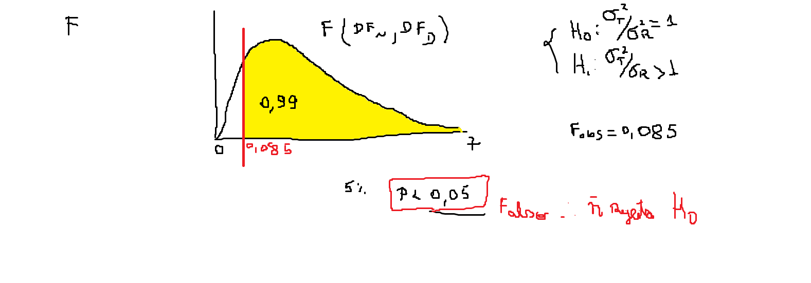

<!-- README.md is generated from README.Rmd. Please edit that file -->

```{r, include = FALSE}
knitr::opts_chunk$set(
  collapse = TRUE,
  warning = FALSE,
  error = FALSE,
  message = FALSE,
  comment = "#>"
)
```

# Projeto de Pesquisa - Efeito do ABA na maturação da cana-de-açúcar

Pizani, GA; Panosso, AR; Cardozo, NP; Silva, MA

    - de altura até ATR temos as repetições por parcela - então tem que fazer média;
    - de TCH1 a TAH6 - temos uma amostragem por bloco, totalizando 64 parcelas (8 tratamentos * 4 blocos * 2 Faz);
    - de A até T° foliar - temos 256 amostras provavelmente (8 tratamentos * 4 blocos * 2 faz* 4 datas de amostragem) - então é uma análise no tempo;
    - de SPS até Ni - temos 320 observações provavelmente (8 tratamentos * 4 blocos * 2 faz* 5 datas de amostragem) - então é uma análise no tempo;

## ANOVAs por Fazendas

### [Análise Tecnológica](https://arpanosso.github.io/projeto-pizani-ga-cardozo-np/Docs/analise-tecnologica.html)
### [Análise Produção](https://arpanosso.github.io/projeto-pizani-ga-cardozo-np/Docs/producao.html)
### [Análise Trocas Gasosas](https://arpanosso.github.io/projeto-pizani-ga-cardozo-np/Docs/analise-trocas-gasosas.html)
### [Análise Enzimática](https://arpanosso.github.io/projeto-pizani-ga-cardozo-np/Docs/analise-enzimatica.html)

## ANOVAs dados combinados das Fazendas

### [Análise Tecnológica](https://arpanosso.github.io/projeto-pizani-ga-cardozo-np/Docs/analise-tecnologica-faz.html)
### [Análise Produção](https://arpanosso.github.io/projeto-pizani-ga-cardozo-np/Docs/producao-faz.html)
### [Análise Trocas Gasosas](https://arpanosso.github.io/projeto-pizani-ga-cardozo-np/Docs/analise-trocas-gasosas-faz.html)
### [Análise Enzimática](https://arpanosso.github.io/projeto-pizani-ga-cardozo-np/Docs/analise-enzimatica-faz.html)

## Análise Multivariada

### Análise de variância - Primeira Rodada
#### Carregando Pacotes
```{r}
library(tidyverse)
library(agricolae)
library(ExpDes.pt)
```


#### Carregando o Banco de dados
```{r}
data_set <- read_rds("data/data-set-principal.rds")
glimpse(data_set)
```

#### Validação dos dados
```{r}
skimr::skim(data_set)
```


#### Análise de variância para `e_n` no delineamento em blocos casualizados

nesse delineamento consideramos dois efeitos, o de bloco e o dos tratamentos, a partir do seguinte modelo de anova (teste F de Snedecor ao nível de $5\%$ de probabilidade)

$$y_{ij} = \mu + \alpha_i + \beta_j + \epsilon_{ij}$$
Pressupostos:  
  1. Efeitos são aditivos  
  2. Erros são independentes  e aleatórios
  3. Erros são normais  
  4. Existe igualdade entre as variâncias dos tratamentos (homocedasticidade)  

##### Recorte do banco de dados
```{r}
data_set_aux <- data_set |> 
  select(c(faz:bloco,e_n)) |> 
  mutate(
    trat = as_factor(trat) 
  ) |> 
  drop_na()
glimpse(data_set_aux)
```

#### Gerar o modelo previamente definido

```{r}
mod_dbc <- aov(e_n ~ trat + bloco,
               data=data_set_aux)
anova(mod_dbc)
```



#### Teste de Pressuposto: Normalidade dos resíduos

$H_0$: Os dados de resíduos studentizados seguem uma distribuição normal

$H_1$: Os dados de resíduos studentizados **não** seguem uma distribuição normal.

```{r}
rs <- rstudent(mod_dbc)
hist(rs)
shapiro.test(rs)
```

### Teste de Pressuposto: Homocedasticidade (igualdade entre as variâncias dos tratamentos)

```{r}
data_set_aux |> 
  ggplot(aes(y=e_n, x=trat, fill=trat)) + 
  geom_boxplot() +
  theme_bw()
```
Teste de levene para homocedasticidade

$H_0$: Os dados são homocedásticos

$H_1$: Os dados **não** são homocedásticos

```{r}
y <- data_set_aux |> pull(e_n)
trat <- data_set_aux |> pull(trat)
lawstat::levene.test(y,trat,location = "median")
```

#### Teste F e teste de separação de médias (Tukey)
```{r}
y <- data_set_aux |> pull(e_n)
trat <- data_set_aux |> pull(trat)
bloco <- data_set_aux |> pull(bloco)
ExpDes.pt::dbc(trat, bloco, y, quali = TRUE, mcomp = "tukey")
```

### Análise de Regressão para Doses

```{r}
data_set_aux |> 
  filter(dose != 999) |> 
  group_by(dose) |>
  summarise(e_n = mean(e_n, na.rm = TRUE)) |>
  ggplot(aes(x=dose, y=e_n, colour = as_factor(dose))) +
  geom_point() +
  geom_line() +
  theme_bw()+
  labs(color = "Dose")
```

