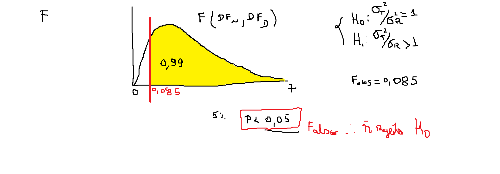
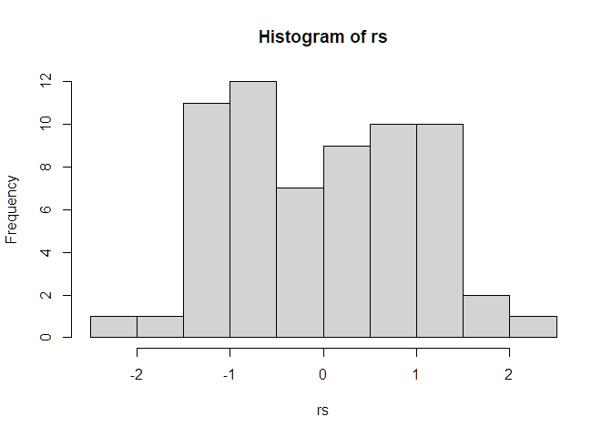
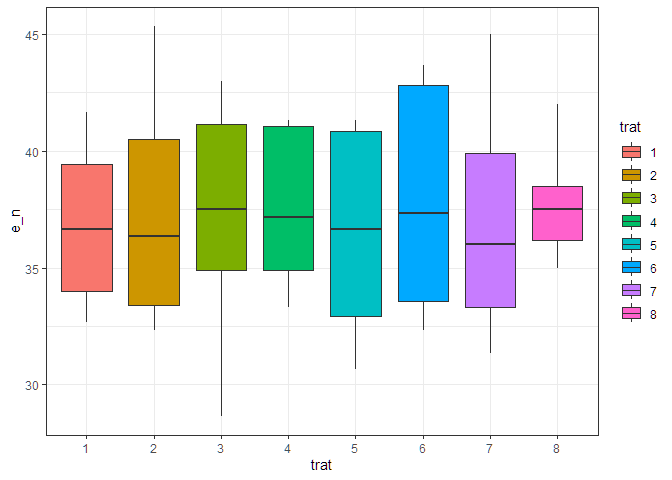
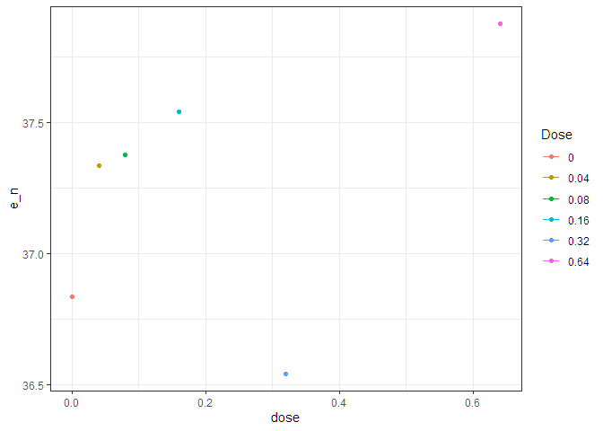

<!-- README.md is generated from README.Rmd. Please edit that file -->

# Projeto de Pesquisa - Efeito do ABA na maturação da cana-de-açúcar

Pizani, GA; Panosso, AR; Cardozo, NP; Silva, MA

    - de altura até ATR temos as repetições por parcela - então tem que fazer média;
    - de TCH1 a TAH6 - temos uma amostragem por bloco, totalizando 64 parcelas (8 tratamentos * 4 blocos * 2 Faz);
    - de A até T° foliar - temos 256 amostras provavelmente (8 tratamentos * 4 blocos * 2 faz* 4 datas de amostragem) - então é uma análise no tempo;
    - de SPS até Ni - temos 320 observações provavelmente (8 tratamentos * 4 blocos * 2 faz* 5 datas de amostragem) - então é uma análise no tempo;

### [Análise tecnológica](https://arpanosso.github.io/projeto-pizani-ga-cardozo-np/Docs/analise-tecnologica.html)

### [Produção](https://arpanosso.github.io/projeto-pizani-ga-cardozo-np/Docs/producao.html)

### [Análise Trocas Gasosas](https://arpanosso.github.io/projeto-pizani-ga-cardozo-np/Docs/analise-trocas-gasosas.html)

### [Análise enzimática](https://arpanosso.github.io/projeto-pizani-ga-cardozo-np/Docs/analise-enzimatica.html)

### Análise de variância - Primeira Rodada

#### Carregando Pacotes

``` r
library(tidyverse)
library(agricolae)
library(ExpDes.pt)
```

#### Carregando o Banco de dados

``` r
data_set <- read_rds("data/data-set-principal.rds")
glimpse(data_set)
#> Rows: 384
#> Columns: 11
#> $ data         <dttm> 2025-03-17, 2025-03-17, 2025-03-17, 2025-03-17, 2025-03-…
#> $ faz          <dbl> 49, 49, 49, 49, 49, 49, 49, 49, 49, 49, 49, 49, 49, 49, 4…
#> $ trat         <dbl> 1, 1, 1, 1, 2, 2, 2, 2, 3, 3, 3, 3, 4, 4, 4, 4, 5, 5, 5, …
#> $ dose         <dbl> 0.00, 0.00, 0.00, 0.00, 0.04, 0.04, 0.04, 0.04, 0.08, 0.0…
#> $ bloco        <chr> "B1", "B2", "B3", "B4", "B1", "B2", "B3", "B4", "B1", "B2…
#> $ peso         <dbl> 17.67000, 17.17333, 13.43000, 18.05667, 16.69000, 15.2466…
#> $ media_peso   <dbl> 17.67000, 17.17333, 13.43000, 18.05667, 16.69000, 15.2466…
#> $ altura       <dbl> NaN, NaN, NaN, NaN, NaN, NaN, NaN, NaN, NaN, NaN, NaN, Na…
#> $ altura_media <dbl> 2.95, 2.62, 2.69, 2.85, 2.94, 2.58, 2.52, 2.33, 2.71, 2.4…
#> $ e_n          <dbl> NaN, NaN, NaN, NaN, NaN, NaN, NaN, NaN, NaN, NaN, NaN, Na…
#> $ e_n_medio    <dbl> NaN, NaN, NaN, NaN, NaN, NaN, NaN, NaN, NaN, NaN, NaN, Na…
```

#### Validação dos dados

``` r
skimr::skim(data_set)
```

|                                                  |          |
|:-------------------------------------------------|:---------|
| Name                                             | data_set |
| Number of rows                                   | 384      |
| Number of columns                                | 11       |
| \_\_\_\_\_\_\_\_\_\_\_\_\_\_\_\_\_\_\_\_\_\_\_   |          |
| Column type frequency:                           |          |
| character                                        | 1        |
| numeric                                          | 9        |
| POSIXct                                          | 1        |
| \_\_\_\_\_\_\_\_\_\_\_\_\_\_\_\_\_\_\_\_\_\_\_\_ |          |
| Group variables                                  | None     |

Data summary

**Variable type: character**

| skim_variable | n_missing | complete_rate | min | max | empty | n_unique | whitespace |
|:--------------|----------:|--------------:|----:|----:|------:|---------:|-----------:|
| bloco         |         0 |             1 |   2 |   2 |     0 |        4 |          0 |

**Variable type: numeric**

| skim_variable | n_missing | complete_rate | mean | sd | p0 | p25 | p50 | p75 | p100 | hist |
|:---|---:|---:|---:|---:|---:|---:|---:|---:|---:|:---|
| faz | 0 | 1.00 | 97.50 | 48.56 | 49.00 | 49.00 | 97.50 | 146.00 | 146.00 | ▇▁▁▁▇ |
| trat | 0 | 1.00 | 4.50 | 2.29 | 1.00 | 2.75 | 4.50 | 6.25 | 8.00 | ▇▃▇▃▇ |
| dose | 0 | 1.00 | 249.90 | 433.05 | 0.00 | 0.07 | 0.24 | 250.23 | 999.00 | ▇▁▁▁▂ |
| peso | 0 | 1.00 | 17.07 | 2.27 | 11.65 | 15.46 | 17.10 | 18.72 | 23.19 | ▂▆▇▅▁ |
| media_peso | 0 | 1.00 | 17.07 | 2.27 | 11.65 | 15.46 | 17.10 | 18.72 | 23.19 | ▂▆▇▅▁ |
| altura | 64 | 0.83 | 3.11 | 0.31 | 2.06 | 2.88 | 3.10 | 3.31 | 3.80 | ▁▂▇▇▃ |
| altura_media | 0 | 1.00 | 3.03 | 0.34 | 2.06 | 2.78 | 3.02 | 3.27 | 3.80 | ▁▅▇▆▃ |
| e_n | 320 | 0.17 | 37.29 | 4.06 | 28.67 | 33.67 | 37.17 | 40.75 | 45.33 | ▂▇▆▆▃ |
| e_n_medio | 320 | 0.17 | 37.29 | 4.06 | 28.67 | 33.67 | 37.17 | 40.75 | 45.33 | ▂▇▆▆▃ |

**Variable type: POSIXct**

| skim_variable | n_missing | complete_rate | min | max | median | n_unique |
|:---|---:|---:|:---|:---|:---|---:|
| data | 0 | 1 | 2025-03-17 | 2025-05-26 | 2025-04-21 12:00:00 | 6 |

#### Análise de variância para `e_n` no delineamento em blocos casualizados

nesse delineamento consideramos dois efeitos, o de bloco e o dos
tratamentos, a partir do seguinte modelo de anova (teste F de Snedecor
ao nível de $5\%$ de probabilidade)

$$y_{ij} = \mu + \alpha_i + \beta_j + \epsilon_{ij}$$ Pressupostos:  
1. Efeitos são aditivos  
2. Erros são independentes e aleatórios 3. Erros são normais  
4. Existe igualdade entre as variâncias dos tratamentos
(homocedasticidade)

##### Recorte do banco de dados

``` r
data_set_aux <- data_set |> 
  select(c(faz:bloco,e_n)) |> 
  mutate(
    trat = as_factor(trat) 
  ) |> 
  drop_na()
glimpse(data_set_aux)
#> Rows: 64
#> Columns: 5
#> $ faz   <dbl> 49, 49, 49, 49, 49, 49, 49, 49, 49, 49, 49, 49, 49, 49, 49, 49, …
#> $ trat  <fct> 1, 1, 1, 1, 2, 2, 2, 2, 3, 3, 3, 3, 4, 4, 4, 4, 5, 5, 5, 5, 6, 6…
#> $ dose  <dbl> 0.00, 0.00, 0.00, 0.00, 0.04, 0.04, 0.04, 0.04, 0.08, 0.08, 0.08…
#> $ bloco <chr> "B1", "B2", "B3", "B4", "B1", "B2", "B3", "B4", "B1", "B2", "B3"…
#> $ e_n   <dbl> 32.66667, 34.33333, 33.00000, 35.66667, 32.33333, 33.66667, 32.6…
```

#### Gerar o modelo previamente definido

``` r
mod_dbc <- aov(e_n ~ trat + bloco,
               data=data_set_aux)
anova(mod_dbc)
#> Analysis of Variance Table
#> 
#> Response: e_n
#>           Df  Sum Sq Mean Sq F value Pr(>F)
#> trat       7   11.50  1.6429  0.0852 0.9989
#> bloco      3    5.51  1.8380  0.0953 0.9623
#> Residuals 53 1021.76 19.2786
```



#### Teste de Pressuposto: Normalidade dos resíduos

$H_0$: Os dados de resíduos studentizados seguem uma distribuição normal

$H_1$: Os dados de resíduos studentizados **não** seguem uma
distribuição normal.

``` r
rs <- rstudent(mod_dbc)
hist(rs)
```

<!-- -->

``` r
shapiro.test(rs)
#> 
#>  Shapiro-Wilk normality test
#> 
#> data:  rs
#> W = 0.96483, p-value = 0.06498
```

### Teste de Pressuposto: Homocedasticidade (igualdade entre as variâncias dos tratamentos)

``` r
data_set_aux |> 
  ggplot(aes(y=e_n, x=trat, fill=trat)) + 
  geom_boxplot() +
  theme_bw()
```

<!-- --> Teste de
levene para homocedasticidade

$H_0$: Os dados são homocedásticos

$H_1$: Os dados **não** são homocedásticos

``` r
y <- data_set_aux |> pull(e_n)
trat <- data_set_aux |> pull(trat)
lawstat::levene.test(y,trat,location = "median")
#> 
#>  Modified robust Brown-Forsythe Levene-type test based on the absolute
#>  deviations from the median
#> 
#> data:  y
#> Test Statistic = 1.6996, p-value = 0.1278
```

#### Teste F e teste de separação de médias (Tukey)

``` r
y <- data_set_aux |> pull(e_n)
trat <- data_set_aux |> pull(trat)
bloco <- data_set_aux |> pull(bloco)
ExpDes.pt::dbc(trat, bloco, y, quali = TRUE, mcomp = "tukey")
#> ------------------------------------------------------------------------
#> Quadro da analise de variancia
#> ------------------------------------------------------------------------
#>            GL      SQ      QM       Fc   Pr>Fc
#> Tratamento  7   11.50  1.6429 0.085217 0.99887
#> Bloco       3    5.51  1.8380 0.095337 0.96229
#> Residuo    53 1021.76 19.2786                 
#> Total      63 1038.78                         
#> ------------------------------------------------------------------------
#> CV = 11.77 %
#> 
#> ------------------------------------------------------------------------
#> Teste de normalidade dos residuos 
#> valor-p:  0.04299851 
#> ATENCAO: a 5% de significancia, os residuos nao podem ser considerados normais!
#> ------------------------------------------------------------------------
#> 
#> ------------------------------------------------------------------------
#> Teste de homogeneidade de variancia 
#> valor-p:  0.880869 
#> De acordo com o teste de oneillmathews a 5% de significancia, as variancias podem ser consideradas homogeneas.
#> ------------------------------------------------------------------------
#> 
#> De acordo com o teste F, as medias nao podem ser consideradas diferentes.
#>   Niveis   Medias
#> 1      1 36.83333
#> 2      2 37.33333
#> 3      3 37.37500
#> 4      4 37.54167
#> 5      5 36.54167
#> 6      6 37.87500
#> 7      7 37.08333
#> 8      8 37.75000
#> ------------------------------------------------------------------------
```

### Análise de Regressão para Doses

``` r
data_set_aux |> 
  filter(dose != 999) |> 
  group_by(dose) |>
  summarise(e_n = mean(e_n, na.rm = TRUE)) |>
  ggplot(aes(x=dose, y=e_n, colour = as_factor(dose))) +
  geom_point() +
  geom_line() +
  theme_bw()+
  labs(color = "Dose")
```

<!-- -->
